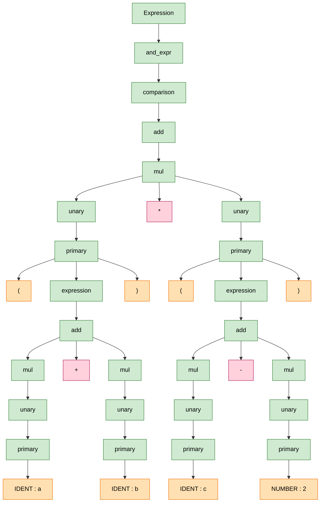

# Лабораторная работа №3

## Раздел 5. Языки программирования и основы трансляции

**Темы:**

* Формальные языки и грамматики
* Основы трансляции программ

---

## 1. Постановка задачи

Целью лабораторной работы является закрепление теоретических знаний и получение практических навыков по следующим направлениям:

* разработка формальных грамматик выражений;
* реализация процедур синтаксического анализа методом рекурсивного спуска;
* построение внутреннего представления выражения в виде дерева;
* разработка интерпретатора выражений на языке C++ с использованием только стандартной библиотеки.

В рамках работы требуется разработать программу, которая:

* распознаёт корректные арифметико-логические выражения;
* обнаруживает и локализует синтаксические ошибки;
* строит дерево выражения;
* выводит выражение в виде обратной польской записи;
* вычисляет значение выражения при заданных значениях переменных.

---

## 2. Описание грамматики выражений

Для решения задачи была разработана LL(1)-грамматика арифметико-логических выражений с поддержкой:

* целых и вещественных чисел;
* идентификаторов (переменных);
* арифметических операций `+ - * /`;
* операций сравнения `== != < > <= >=`;
* логических операций `&& ||`;
* круглых скобок;
* разделителей (пробелов).

### 2.1 Грамматика в расширенной БНФ

```
<expression>   ::= <or_expr>
<or_expr>      ::= <and_expr> { "||" <and_expr> }
<and_expr>     ::= <cmp_expr> { "&&" <cmp_expr> }
<cmp_expr>     ::= <add_expr> [ ("==" | "!=" | "<" | ">" | "<=" | ">=") <add_expr> ]
<add_expr>     ::= <mul_expr> { ("+" | "-") <mul_expr> }
<mul_expr>     ::= <unary> { ("*" | "/") <unary> }
<unary>        ::= ["+" | "-"] <primary>
<primary>      ::= NUMBER | IDENT | "(" <expression> ")"
```

Грамматика не содержит левой рекурсии и пригодна для синтаксического анализа методом рекурсивного спуска.

---

## 3. Примеры выражений

### 3.1 Синтаксически корректные выражения

* `a + b * 3`
* `(x - 2) * y`
* `a > 5 && b < 10`
* `(a + b) >= c || d != 0`
* `x / 2 + y * 4`

### 3.2 Выражения с ошибками

* `a + * b` — отсутствует операнд
* `(a + b` — отсутствует закрывающая скобка
* `a && || b` — неверная последовательность операций
* `5 / (3 - 3)` — семантическая ошибка (деление на ноль)

При обнаружении ошибок программа прекращает разбор и выводит сообщение с указанием причины ошибки и позиции символа.

---

## 4. Алгоритм синтаксического анализа

Синтаксический анализ реализован методом рекурсивного спуска. Для каждого нетерминала грамматики разработана отдельная функция.

Общий алгоритм:

1. Лексический анализ входной строки и получение токенов.
2. Последовательный вызов функций разбора в соответствии с грамматикой.
3. При успешном разборе — построение дерева выражения.
4. При обнаружении ошибки — прекращение разбора и вывод сообщения об ошибке.

Каждая функция разбора:

* проверяет корректность текущего токена;
* вызывает функции более низкого приоритета;
* обеспечивает соблюдение приоритетов операций.

---

## 5. Внутреннее представление выражения

Для представления выражения используется бинарное дерево.

* Листовые вершины — числа или переменные.
* Внутренние вершины — операции.

Структура узла дерева:

* строка с именем операции или переменной;
* числовое значение (для констант);
* указатели на левое и правое поддерево.

В случае ошибки в записи выражения построенное дерево не используется.

---

## 6. Обратная польская запись

Для вывода выражения в обратной польской записи используется рекурсивный обход дерева (postorder).

Пример:

Исходное выражение:

```
a + b * 3
```

Обратная польская запись:

```
a b 3 * +
```

---

## 7. Интерпретация выражений

Вычисление значения выражения выполняется рекурсивным обходом дерева.

Алгоритм вычисления:

* если узел — число, возвращается его значение;
* если узел — переменная, значение берётся из таблицы идентификаторов;
* если узел — операция, рекурсивно вычисляются подвыражения и применяется операция.

Реализована обработка следующих ошибок:

* использование неинициализированных переменных;
* деление на ноль;
* неизвестные операции.

---

## 8. Работа с переменными

Для хранения значений переменных используется таблица идентификаторов на основе `std::map`.

Пользователь вводит значения всех переменных перед выполнением вычислений, что исключает повторный ввод значений и снижает вероятность ошибок.

Программа поддерживает повторное вычисление выражения с другими значениями переменных без повторного синтаксического анализа.

---

## 9. Тестирование

В ходе тестирования были проверены:

* все правила грамматики;
* корректные и некорректные выражения;
* обработка семантических ошибок;
* корректность построения дерева и обратной польской записи.

Результаты тестирования подтвердили корректность работы программы.

---

## 10. Заключение

В ходе выполнения лабораторной работы:

* разработана расширенная грамматика выражений;
* реализован синтаксический анализ методом рекурсивного спуска;
* построено дерево выражения;
* реализован интерпретатор выражений;
* обеспечена диагностика синтаксических и семантических ошибок.

Поставленные задачи выполнены в полном объёме, требования лабораторной работы соблюдены.



