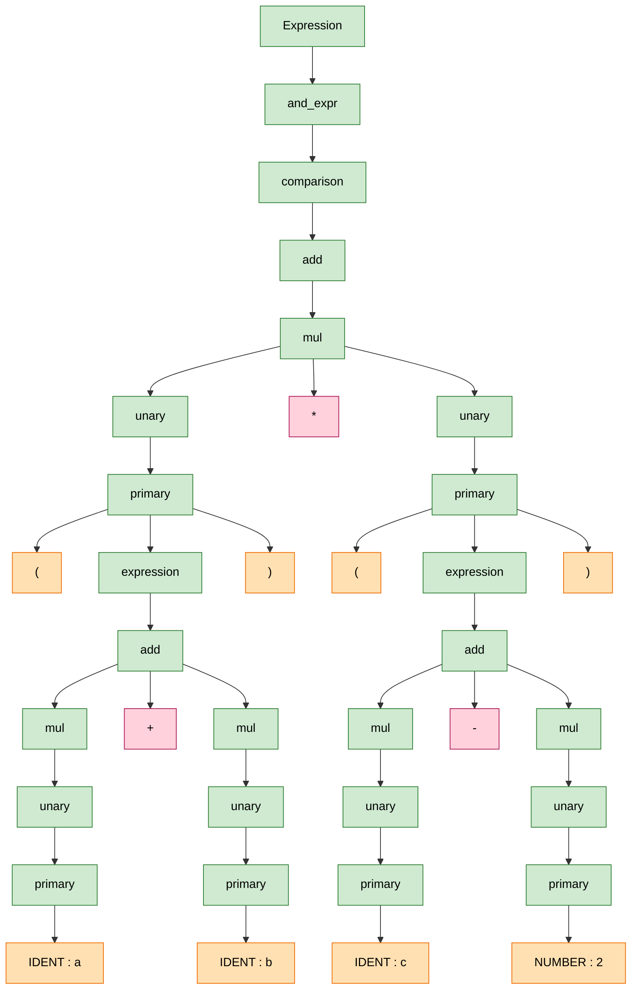
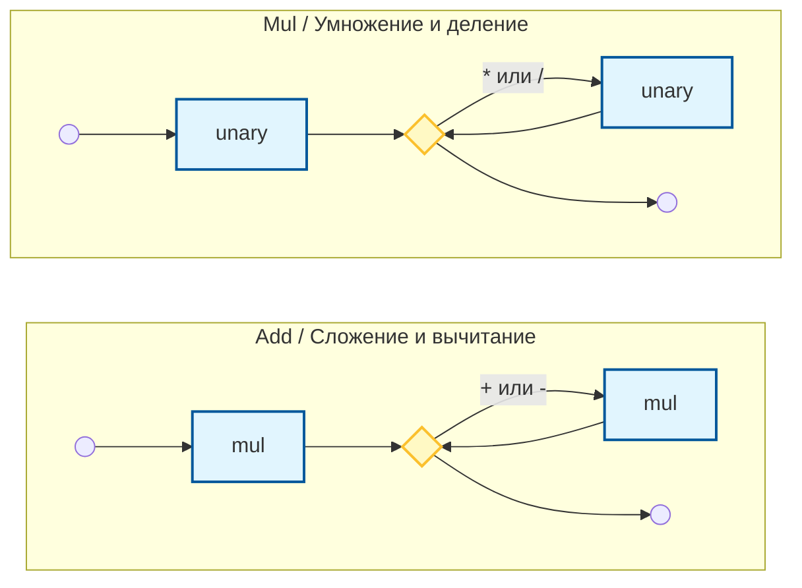
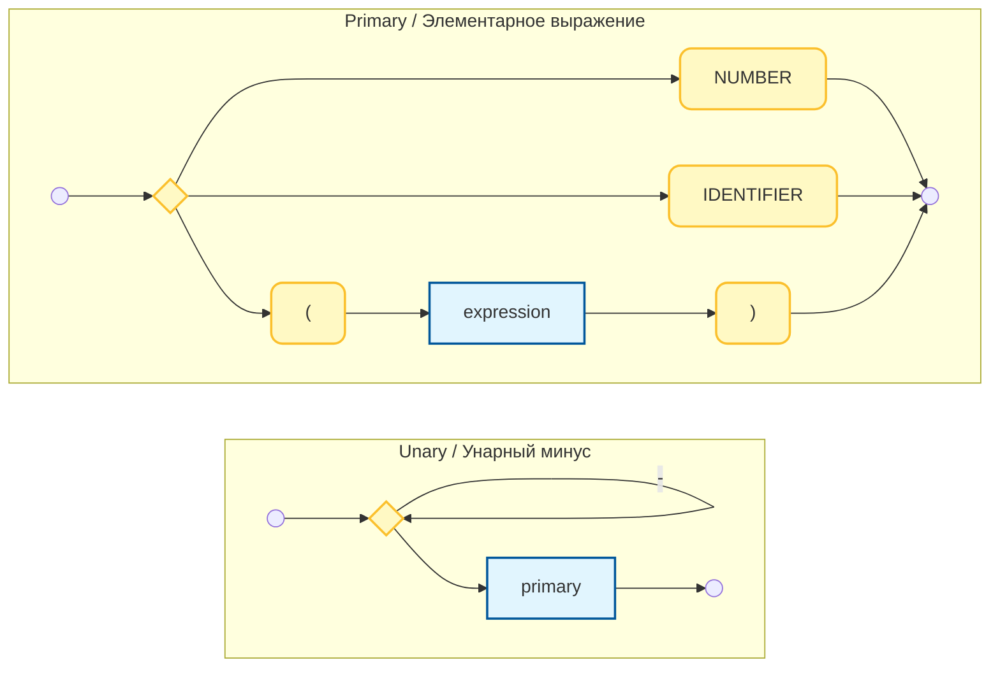

```mermaid
flowchart TD
  E["Expression"] --> AE["and_expr"]
  AE --> CMP["comparison"]
  CMP --> ADD0["add"]
  ADD0 --> MUL0["mul"]

  %% (a + b)
  MUL0 --> U1["unary"]
  U1 --> P1["primary"]
  P1 --> LPAR1["("]
  P1 --> EX1["expression"]
  P1 --> RPAR1[")"]

  EX1 --> ADD1["add"]
  ADD1 --> MUL1["mul"]
  MUL1 --> U1A["unary"]
  U1A --> P1A["primary"]
  P1A --> AID["IDENT : a"]

  ADD1 --> PLUS["+"]

  ADD1 --> MUL2["mul"]
  MUL2 --> U1B["unary"]
  U1B --> P1B["primary"]
  P1B --> BID["IDENT : b"]

  %% *
  MUL0 --> STAR["*"]

  %% (c - 2)
  MUL0 --> U2["unary"]
  U2 --> P2["primary"]
  P2 --> LPAR2["("]
  P2 --> EX2["expression"]
  P2 --> RPAR2[")"]

  EX2 --> ADD2["add"]
  ADD2 --> MUL3["mul"]
  MUL3 --> U2A["unary"]
  U2A --> P2A["primary"]
  P2A --> CID["IDENT : c"]

  ADD2 --> MINUS["-"]

  ADD2 --> MUL4["mul"]
  MUL4 --> U2B["unary"]
  U2B --> P2B["primary"]
  P2B --> NUM["NUMBER : 2"]

  %% Styles
  classDef nonterm fill:#cfead1,stroke:#2e7d32,stroke-width:1px,color:#000;
  classDef op fill:#ffd1dc,stroke:#ad1457,stroke-width:1px,color:#000;
  classDef term fill:#ffe0b2,stroke:#ef6c00,stroke-width:1px,color:#000;

  class E,AE,CMP,ADD0,MUL0,EX1,ADD1,MUL1,MUL2,U1,U1A,U1B,P1,P1A,P1B,EX2,ADD2,MUL3,MUL4,U2,U2A,U2B,P2,P2A,P2B nonterm;
  class PLUS,MINUS,STAR op;
  class AID,BID,CID,NUM,LPAR1,RPAR1,LPAR2,RPAR2 term;
```

```mermaid
flowchart LR
    %% Стили
    classDef nonterm fill:#e1f5fe,stroke:#01579b,stroke-width:2px;
    classDef term fill:#fff9c4,stroke:#fbc02d,stroke-width:2px,rx:10,ry:10;
    classDef startend fill:#000,stroke:#000,stroke-width:1px,r:5;

    %% Expression
    subgraph Expression [Expression / Выражение]
        direction LR
        S1(( )) --> AE_Call[and_expr]
        AE_Call --> CheckOR{ }
        CheckOR -- "||" --> AE_Call2[and_expr]
        AE_Call2 --> CheckOR
        CheckOR --> E1(( ))
    end

    %% AndExpr
    subgraph AndExpr [AndExpr / Логическое И]
        direction LR
        S2(( )) --> C_Call[comparison]
        C_Call --> CheckAND{ }
        CheckAND -- "&&" --> C_Call2[comparison]
        C_Call2 --> CheckAND
        CheckAND --> E2(( ))
    end

    %% Comparison
    subgraph Comparison [Comparison / Сравнение]
        direction LR
        S3(( )) --> Add_Call[add]
        Add_Call --> CheckCMP{ }
        CheckCMP -- "== != < > <= >=" --> Add_Call2[add]
        Add_Call2 --> E3(( ))
        CheckCMP --> E3
    end

    class AE_Call,AE_Call2,C_Call,C_Call2,Add_Call,Add_Call2 nonterm;
    class CheckOR,CheckAND,CheckCMP term;
```

```mermaid
flowchart LR
    %% Стили
    classDef nonterm fill:#e1f5fe,stroke:#01579b,stroke-width:2px;
    classDef term fill:#fff9c4,stroke:#fbc02d,stroke-width:2px,rx:10,ry:10;

    %% Add
    subgraph Add [Add / Сложение и вычитание]
        direction LR
        S4(( )) --> Mul_Call[mul]
        Mul_Call --> CheckADD{ }
        CheckADD -- "+ или -" --> Mul_Call2[mul]
        Mul_Call2 --> CheckADD
        CheckADD --> E4(( ))
    end

    %% Mul
    subgraph Mul [Mul / Умножение и деление]
        direction LR
        S5(( )) --> U_Call[unary]
        U_Call --> CheckMUL{ }
        CheckMUL -- "* или /" --> U_Call2[unary]
        U_Call2 --> CheckMUL
        CheckMUL --> E5(( ))
    end

    class Mul_Call,Mul_Call2,U_Call,U_Call2 nonterm;
    class CheckADD,CheckMUL term;
```

```mermaid
flowchart LR
    %% Стили
    classDef nonterm fill:#e1f5fe,stroke:#01579b,stroke-width:2px;
    classDef term fill:#fff9c4,stroke:#fbc02d,stroke-width:2px,rx:10,ry:10;

    %% Unary
    subgraph Unary [Unary / Унарный минус]
        direction LR
        S6(( )) --> CheckMinus{ }
        CheckMinus -- "-" --> CheckMinus
        CheckMinus --> Prim_Call[primary]
        Prim_Call --> E6(( ))
    end

    %% Primary
    subgraph Primary [Primary / Элементарное выражение]
        direction LR
        S7(( )) --> Fork{ }
        Fork --> Num[NUMBER]
        Fork --> Id[IDENTIFIER]
        Fork --> LPar["( "]
        LPar --> Expr_Call[expression]
        Expr_Call --> RPar[" )"]
        
        Num --> E7(( ))
        Id --> E7
        RPar --> E7
    end

    class Prim_Call,Expr_Call nonterm;
    class CheckMinus,Fork,Num,Id,LPar,RPar term;

```
