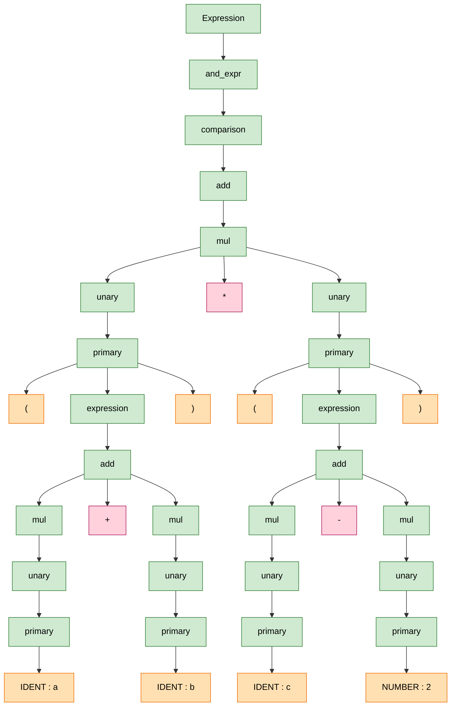

```mermaid
flowchart TD
  E["Expression"] --> AE["and_expr"]
  AE --> CMP["comparison"]
  CMP --> ADD0["add"]
  ADD0 --> MUL0["mul"]

  %% (a + b)
  MUL0 --> U1["unary"]
  U1 --> P1["primary"]
  P1 --> LPAR1["("]
  P1 --> EX1["expression"]
  P1 --> RPAR1[")"]

  EX1 --> ADD1["add"]
  ADD1 --> MUL1["mul"]
  MUL1 --> U1A["unary"]
  U1A --> P1A["primary"]
  P1A --> AID["IDENT : a"]

  ADD1 --> PLUS["+"]

  ADD1 --> MUL2["mul"]
  MUL2 --> U1B["unary"]
  U1B --> P1B["primary"]
  P1B --> BID["IDENT : b"]

  %% *
  MUL0 --> STAR["*"]

  %% (c - 2)
  MUL0 --> U2["unary"]
  U2 --> P2["primary"]
  P2 --> LPAR2["("]
  P2 --> EX2["expression"]
  P2 --> RPAR2[")"]

  EX2 --> ADD2["add"]
  ADD2 --> MUL3["mul"]
  MUL3 --> U2A["unary"]
  U2A --> P2A["primary"]
  P2A --> CID["IDENT : c"]

  ADD2 --> MINUS["-"]

  ADD2 --> MUL4["mul"]
  MUL4 --> U2B["unary"]
  U2B --> P2B["primary"]
  P2B --> NUM["NUMBER : 2"]

  %% Styles
  classDef nonterm fill:#cfead1,stroke:#2e7d32,stroke-width:1px,color:#000;
  classDef op fill:#ffd1dc,stroke:#ad1457,stroke-width:1px,color:#000;
  classDef term fill:#ffe0b2,stroke:#ef6c00,stroke-width:1px,color:#000;

  class E,AE,CMP,ADD0,MUL0,EX1,ADD1,MUL1,MUL2,U1,U1A,U1B,P1,P1A,P1B,EX2,ADD2,MUL3,MUL4,U2,U2A,U2B,P2,P2A,P2B nonterm;
  class PLUS,MINUS,STAR op;
  class AID,BID,CID,NUM,LPAR1,RPAR1,LPAR2,RPAR2 term;
```
